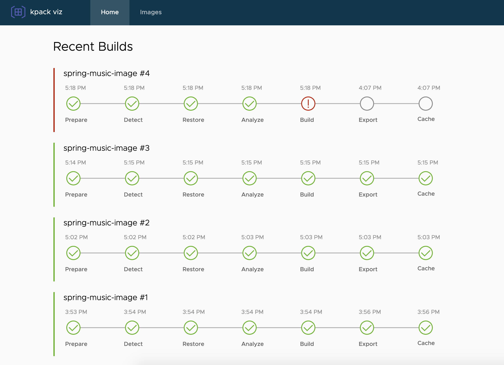

# kpack-viz


`kpack-viz` is an application for viewing the state of `kpack` running in your Kubernetes cluster.

High-level features include:
- Live dashboard of recent builds
- Image browser
- Build log viewer
- Bill of materials for each build
- Compare two builds to understand what changed



The current limitations are:
- Detailed image information, such as the BOM, can only be read from Harbor
- Only builds/images still stored in the Kubernetes cluster can be viewed, as there is currently no persistence

## Usage

The tool can be run either locally or in the Kubernetes cluster where `kpack` is installed.

Pre-requisites:
- Kubernetes cluster
- `kpack` installed
- (Optional) Harbor registry

### Local

Running locally is relatively straightforward. It has particular requirements above what was previously specified:
- You must have `kubectl` logged in to the cluster where `kpack` is installed, as it currently inherits that endpoint/credential information
- Golang 1.13
- `statik` >= 0.1.17
- `node` >= 12.X
- Angular >= 9.X

Build the application:

```
./build.sh
```

Then run it:

```
./kpack-viz
```

This will start the server on port `8080`, so access the following URL in your browser:

```
http://localhost:8080
```

### In Kubernetes

TODO
